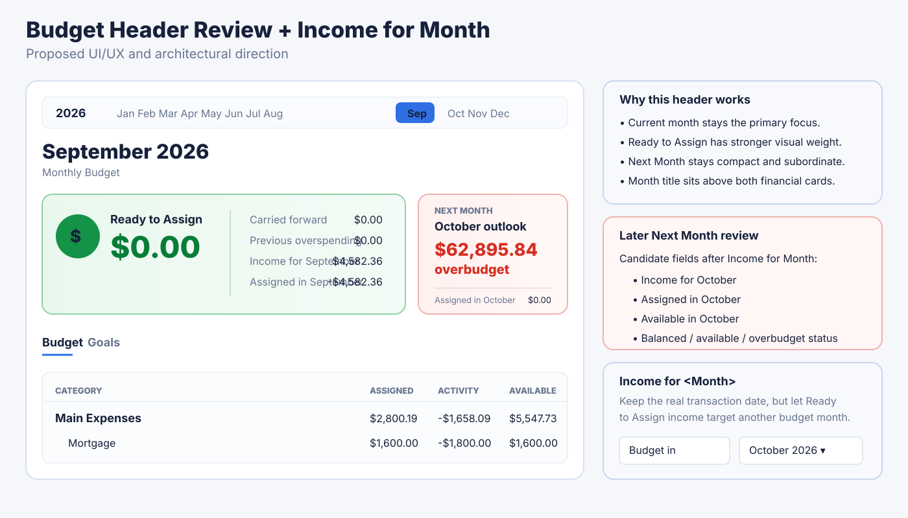

# Product Roadmap

*Last reconciled: 24 September 2026 against `master` at `7a637a4cd631e9199dae1ca9c4c55be315f7e64b`.*

This is the **single authoritative product roadmap** for Budget App.

Supporting documents may describe architecture, design rationale, implementation
contracts or historical decisions, but they do **not** define product priority
or roadmap status. If another document appears to conflict with this file, this
roadmap controls sequencing/status and the relevant supporting document should
be updated separately.

Guiding sequence:

**Correct → Reliable → Fast → Polished → Smart**

## How to read this roadmap

Status labels:

- **COMPLETE** — implemented and accepted as the current baseline.
- **ACTIVE / NEXT** — the next ordered work unless a blocking defect requires
  interruption.
- **PLANNED** — accepted work with a defined place in the queue.
- **PARKED** — intentionally deferred until user value justifies reopening it.
- **CANDIDATE** — worth considering, but not committed work.

Priority numbers below are the working execution order. When work is completed,
move it to the completed baseline and renumber the remaining queue rather than
creating a second ordering list elsewhere in this document.

---

# 1. Current Product Baseline

## Architecture and persistence — COMPLETE

The application currently has:

- SQLite/OPFS as the authoritative interactive budget state;
- one intended physical SQLite worker / ownership boundary;
- serialized local commands;
- atomic canonical + outbox writes;
- local ordinary reads with background relay/control-plane convergence;
- multi-tab ownership and suspension/reacquisition handling;
- bounded revision-valid reactive query caching;
- Account Register pagination and mutation deltas;
- Budget workspace virtualization;
- warm navigation/bootstrap paths;
- CI performance evidence and bundle budgets;
- persistent application-history/undo-redo foundations.

Do not reopen persistence architecture without concrete correctness evidence or
measured browser evidence.

Detailed references:

- [Local-first SQLite architecture](local-first-sqlite-architecture.md)
- [Persistence and sync](persistence-and-sync.md)
- [Application history](architecture/application-history.md)
- [Performance finalisation](architecture/performance-finalisation.md)

## Imports and data integrity — SUBSTANTIALLY COMPLETE

Implemented foundations include:

- YNAB4 import;
- Actual Budget import;
- CSV/QIF/OFX-style bank import infrastructure;
- staged import/review;
- deterministic matching and manual matching;
- provenance/source fingerprints;
- payee/category inference;
- splits, transfers, tags and attachments;
- import edit preservation;
- matched/new presentation;
- recent-import badges and bounded row highlighting;
- overlapping-file/occurrence-aware protections;
- exact committed import history through the application-history path.

Recent completed import work:

- PR #80 — review clarity and preservation of reviewed payee edits;
- PR #83 — session-scoped badges and bounded recent-import tint;
- PR #84 — possible-match editing correctly becomes an import proposal.

Detailed reference:

- [Import and Data Integrity](import-and-data-integrity.md)

## Performance, navigation and tab lifecycle — COMPLETE BASELINE

Implemented foundations include:

- P0.6 projection benchmark/rebaseline;
- P0.7 Budget virtualization;
- P0.8 warm startup and multi-tab ownership;
- shared startup authentication status;
- local-first startup ordering;
- Account Register lazy loading/chunk splitting;
- sidebar account-identity first paint;
- Register prefetch/bootstrap reuse;
- Register navigation snapshot retention;
- scheduled-preview warming;
- foreground database reacquisition after suspension;
- exact-head CI with Linux canonical verification and Windows required tests.

Recent completed work:

- PR #71 — performance finalisation;
- PR #72 — sidebar startup account loading;
- PR #73 — tab-suspension Register access;
- PR #77 — prefetched Register bootstrap reuse;
- PR #78 — navigation snapshot retention;
- PR #79 — scheduled transactions painted with Register;
- PR #82 — foreground budget reactivation race fix.

## Budget workspace — ACTIVE PRODUCT AREA WITH MAJOR FOUNDATIONS COMPLETE

Completed Budget UX foundations now include:

- horizontal year/month navigation;
- authoritative Ready to Assign breakdown;
- authoritative next-month outlook;
- refreshed Budget planning header with month title above summary cards;
- coloured, higher-emphasis Ready to Assign summary;
- compact Next Month card showing authoritative status and next-month Assigned;
- contextual Category Details panel instead of a permanently empty inspector;
- Category Details tabs for Overview, Goal, Activity and Notes;
- goal progress/editing through the existing goal subsystem;
- category recent activity through the authoritative SQLite drilldown;
- generic categorised-transfer activity, including on-budget → off-budget
  transfers;
- account-aware transfer labels such as `Transfer to <account>`;
- no-selection full-width Budget table;
- existing Budget virtualization retained.

Recent completed work:

- PR #87 — next-month Budget outlook;
- PR #88 — contextual Category Details;
- PR #90 — refreshed Budget planning header.

Design reference:

## Scheduled Transactions — STRONG FOUNDATION, PRODUCT UX STILL PLANNED

Implemented foundations include create/edit, recurrence, preview/Enter/Skip
infrastructure and scheduled-transaction discovery.

PR #85 added discovery that:

- analyses up to 18 months of current-account history;
- detects weekly, fortnightly, monthly, quarterly, half-yearly and yearly
  recurrence;
- uses stable payee identity with normalized merchant fallback;
- separates stable from variable amounts;
- infers categories only with sufficiently dominant evidence;
- suppresses equivalent active schedules;
- supports Review / Ignore;
- allows one-click creation only for high-confidence fixed candidates.

Transfer discovery, split-schedule discovery and richer variable-amount
semantics remain deferred within the Scheduled Transactions workstream.

## Reports and dashboard — PARTIAL FOUNDATION COMPLETE

Implemented:

- reports framework/navigation;
- Spending by Category;
- Budget vs Actual;
- Dashboard net-worth trend;
- Dashboard monthly financial summary.

Outstanding reporting work is listed later in the ordered queue/backlog.

## Multi-user / recovery / operability — PARTIAL FOUNDATION COMPLETE

Implemented foundations include:

- authentication and sessions;
- administrator-created users;
- budget membership roles/authorization;
- User Management;
- restore points and backup/recovery infrastructure;
- persistent development service under systemd user service/lingering.

Detailed operational reference:

- [Operations and Recovery](operations-and-recovery.md)

---

# 2. Ordered Work Queue

This is the **only active ordering list**. Deal with item **1** first unless a
blocking correctness/security defect requires immediate interruption.

## 1 — Budget: wire Move Money + user-visible movement history — ACTIVE / NEXT

The Category Details `Move Money` control is deliberately disabled today.

Implement a real generic category-to-category money-movement workflow using the
existing local-first money-movement/Application History command path.

Requirements:

- ordinary source → destination category movement;
- amount entry and validation;
- no reuse of Cover Overspending semantics as the generic workflow;
- support multi-source movement where the UX calls for it;
- preserve local-first command/history architecture;
- undo removes the effective movement/history entry;
- redo restores it;
- compact user-visible history of currently effective movements;
- history records at minimum date, amount, source category/categories and
  destination category;
- no separate "undone" audit event;
- focused unit/integration/browser regression coverage before enabling the
  Category Details action.

## 2 — Budget: complete Income for <Month> end-to-end — PLANNED

The domain has long contained month-level income concepts, but the current
authoritative local-first projection still derives Ready to Assign income from
the transaction's calendar month.

Complete the intended YNAB4-style capability where money received today can be
designated as income for another budget month without falsifying the
transaction date.

Architecture requirements:

- preserve the real transaction date for account balance, reconciliation and
  cash-flow history;
- introduce an explicit projection-authoritative, local-first income-allocation
  fact;
- do not change the transaction date to simulate deferral;
- do not create fake future transactions;
- support ordinary and split Ready to Assign income;
- define valid destination-month rules;
- projection cache invalidation must remain correct;
- editing/deleting the source transaction must update/remove the allocation
  safely;
- undo/redo must include the allocation;
- YNAB4 deferred-income import semantics should migrate into the same native
  representation rather than remain a special imported-only path;
- add regression coverage for current-month and future-month income allocation.

UX requirement:

- Ready to Assign income transaction editing should expose a clear
  **Budget in** month selector.

Relevant historical decision reference:

- [ADR-004 Limited Future Budgeting](adr/ADR-004-limited-future-budgeting.md)

## 3 — Budget: revisit header information architecture after Income for <Month> — PLANNED

Do this **after item 2**, because future-month income materially changes what the
Next Month summary can truthfully display.

Review:

- Ready to Assign hierarchy and breakdown;
- Next Month hierarchy and density;
- whether to display:
  - Income for <month>;
  - Assigned in <month>;
  - Available in <month>;
  - resulting Ready to Assign / balanced / overbudget state;
- do **not** show future Activity unless the product deliberately introduces
  projected/scheduled activity semantics;
- desktop/tablet/mobile behaviour;
- accessibility and focus order;
- whether any information is redundant.

Use the current header implementation and the design-reference graphic above as
the starting point rather than redesigning from scratch.

## 4 — Budget: finish Category Details responsive behaviour + focused acceptance coverage — PLANNED

Desktop Category Details is implemented. Complete the deferred adaptive layer:

- tablet overlay drawer;
- mobile full-screen sheet;
- selection/close/focus lifecycle;
- keyboard accessibility;
- no overlap with sticky Budget chrome;
- browser acceptance coverage for:
  - goal dialog layering;
  - categorised on-budget → off-budget transfer activity;
  - Category Details open/close and responsive presentation.

Keep the existing desktop contextual-panel behavior.

## 5 — Import workflow close-out review — PLANNED

Perform the bounded review already agreed for the completed importer.

Verify:

- CSV/QIF/OFX ingestion/detection and invalid-file handling;
- possible-match / proposed-transaction states;
- manual edits remain authoritative;
- transfers and splits;
- matched versus new transaction ownership;
- atomic commit;
- provenance/fingerprint retention;
- exact/overlapping re-import behavior;
- recent-import badge/tint lifetime;
- genuinely new/unseen QIF acceptance in a clean test budget.

Fix only concrete defects found. Do not redesign the importer merely for code
cleanliness.

## 6 — Performance/navigation/tab-lifecycle close-out review — PLANNED

Regression-review the finished performance programme in the VM/browser:

- startup shell and sidebar identity first paint;
- Budget first paint;
- Budget → Account;
- Account → Budget → Account;
- Account → Account;
- rapid switching;
- hover/focus prefetch;
- Register warm bootstrap and authoritative refresh;
- pagination/running balances;
- scheduled preview;
- leave/return after tab suspension;
- multi-tab ownership/reacquisition.

Use measured evidence. Do not introduce a second cache/authority or retries/sleeps
for correctness.

## 7 — Full-application adaptive/mobile/UI scalability audit — PLANNED

Review the entire product at representative desktop, tablet and mobile widths,
including larger browser zoom/text.

Audit:

- shell/navigation;
- Budget Manager;
- Dashboard;
- Budget workspace;
- Account Register;
- transaction entry/editing;
- splits/transfers;
- Scheduled Transactions;
- import review;
- Payee Management;
- Settings;
- Reports;
- User Management;
- dialogs/menus/floating UI;
- errors/toasts;
- attachments.

Produce a page/flow findings matrix with severity, owner and implementation
sequence. Route feature-specific findings into their owning roadmap item.

## 8 — Transaction Entry UX — PLANNED

Audit first, then improve in bounded passes:

- initial focus;
- field order;
- Tab/keyboard flow;
- date/payee/category/account/transfer entry;
- inflow/outflow;
- splits;
- validation;
- Save / Save & Add Another / Cancel;
- create/edit consistency;
- mobile amount-first flow;
- accessibility;
- high-value browser coverage.

## 9 — Broader Account Register UX — PLANNED

Review:

- row focus/edit clarity;
- selection/bulk actions;
- search/filter ergonomics;
- keyboard navigation;
- pagination/load-more;
- empty/loading/error states;
- contextual actions;
- Account Groups / custom sidebar organisation as a presentation/navigation
  feature.

## 10 — Register Customisation + Adaptive Register — PLANNED

Build a coherent user-facing customization experience around existing
foundations:

- column visibility;
- density/display choices;
- persisted preferences;
- reset/default behavior;
- accessibility;
- keyboard compatibility.

Then implement Register-specific adaptive/mobile findings from item 7.

## 11 — Scheduled Transactions product UX — PLANNED

Review/refine:

- create/edit flow;
- recurrence language;
- due/overdue clarity;
- preview/entry relationship;
- Enter/Skip;
- discovery follow-up;
- adaptive/mobile presentation.

High-value planned candidate within this workstream:

- Scheduled Transaction Calendar using the existing schedule/preview/Enter/Skip
  authority, showing upcoming income/bills, funding state and due/overdue status.

## 12 — Shared application polish + Settings UX — PLANNED

Cross-cutting polish after the major workflows:

- dialogs;
- toasts;
- validation;
- errors/recovery;
- loading/empty states;
- Settings consistency;
- attachment UX;
- keyboard/accessibility;
- responsive consistency.

Also perform the dedicated Settings UX review that was present in the older
roadmap and should remain explicit.

## 13 — Codebase health / runtime close-out — PLANNED, BOUNDED

Do not turn this into another architecture rewrite.

Audit/fix only evidence-backed issues in:

- dead/obsolete/compatibility code;
- stale architecture vocabulary/docs;
- test quality;
- duplicated/fragile high-pressure modules;
- dependency/config drift;
- route integrity;
- server error semantics;
- operational/security hygiene.

### Node.js 24

Still outstanding as of this reconciliation:

- root engine policy remains `>=22.12.0`;
- Verify CI still uses Node 22 on Linux and Windows.

Treat Node 24 as a bounded migration:

1. validate current Node 24 LTS;
2. run canonical verification and large performance benchmarks;
3. verify better-sqlite3, Playwright, Vite, worker/server behavior;
4. update CI/runtime/docs only if evidence is clean;
5. update the VM/systemd PATH and re-verify the development service.

---

# 3. Product Backlog After the Ordered Queue

These items are accepted work but currently sit behind the numbered queue.

## Data portability

- CSV export;
- duplicate/clone budget;
- Start Fresh while preserving selected structure;
- archive/trim-history workflows where safe;
- template-from-budget if user value justifies it.

Build these on existing backup/restore/export integrity.

## Transaction discovery

- All Transactions;
- richer saved search/filter workflows;
- Saved Views/filter presets for common searches such as uncategorised,
  uncleared, large transactions, tags, payees and date periods.

## Reporting

Outstanding:

- dedicated Net Worth report;
- dedicated Income & Expenses report;
- broader reports;
- saved report configurations;
- customisable report dashboards/widgets after saved configurations exist.

Optional financial-health metrics such as savings rate/Age-of-Money-style
measures require a clear definition before implementation.

## Rules and automation

- saved transaction rules;
- payee/category automation;
- workflow automation beyond Scheduled Transactions.

Any future automatic bank feed must flow through the existing
proposal/matching/provenance architecture rather than create a second import
authority.

## Planning

- forecasting;
- broader savings planning beyond category goals;
- debt planning;
- multicurrency feasibility review before implementation.

Multicurrency is a domain-level feature, not a display toggle. It would require
explicit base/native currency, transfer/conversion, historical-rate, reporting
and import semantics.

## Self-hosting / deployment / multi-user productisation

Development-service operability is already complete.

Outstanding:

- production build/serving model;
- reverse proxy/TLS where appropriate;
- environment/configuration model;
- deployment and upgrade workflow;
- backup/restore operational UX;
- diagnostics/observability;
- packaging/containerisation if useful;
- password/account lifecycle UX;
- fuller member/role management;
- shared-budget activity history.

## Security / hardening

Later productisation phase covering broader:

- authentication/authorization hardening;
- deployment/runtime hardening;
- security review;
- operational recovery;
- diagnostics/observability;
- documentation.

Concrete security/correctness defects should still be fixed immediately when
found.

---

# 4. Parked / Deferred

Keep parked unless evidence or user value changes the priority:

- Review Overspending;
- full reconciliation workflow;
- goal/target consolidation beyond current working foundations;
- historical matched-transfer display issue if it becomes reproducible;
- payee merge undo/redo;
- category merge undo/redo;
- deleting assigned tags as a compound history command;
- richer Scheduled Transaction transfer/split discovery;
- automatic bank sync;
- Developer API / CLI;
- PWA/install experience;
- privacy/scramble mode;
- multicurrency implementation before feasibility work.

Overspending remains three separate concepts:

1. **Cover Overspending** — COMPLETE.
2. **Overspending policy/category settings** — COMPLETE.
3. **Review Overspending** — PARKED.

Do not accidentally reintroduce Cover Overspending or Actual Budget import as
unfinished work.

---

# 5. Completed Milestone Register

This section is intentionally concise. Git history and tests preserve detailed
implementation history.

## Financial correctness / local-first architecture — COMPLETE BASELINE

- Local Budget Engine command boundary.
- SQLite/OPFS authority.
- Canonical + outbox atomicity.
- Conflict recovery separation.
- P0.4 Register mutation deltas.
- P0.5 reactive query cache.
- P0.6 projection benchmark.
- P0.7 Budget virtualization.
- P0.8 warm startup/multi-tab ownership.
- persistent application history/undo-redo.
- backup/restore/version-history foundations.

## Theme/CSS ownership — COMPLETE FOR AGREED SCOPE

Completed theme passes removed high-risk repair layers and established feature
ownership for Budget/Register/Scheduled Transactions responsive/theme rules.
Remaining CSS cleanup is maintainability work only when concrete product work
exposes debt.

## Import foundations — COMPLETE; REVIEW REMAINS

- YNAB4.
- Actual Budget.
- bank import.
- review/matching/provenance.
- edit preservation.
- recent-import presentation lifetime.
- possible-match proposal-state correction.

## Budget UX foundations — COMPLETE; FOLLOW-UPS ORDERED ABOVE

- Cover Overspending.
- overspending policy/category settings.
- month navigation/RTA breakdown.
- next-month outlook.
- contextual Category Details.
- transfer-aware category activity.
- refreshed planning header.

## Scheduled Transaction discovery — COMPLETE V1

PR #85 is the baseline. Future work should extend it rather than introduce a
parallel recurrence-discovery system.

## Reporting foundation — COMPLETE

- Spending by Category.
- Budget vs Actual.
- Dashboard net-worth/monthly summary.

---

# 6. Engineering Guardrails

These apply to every roadmap item:

- one intended SQLite worker / ownership boundary;
- SQLite/OPFS remains authoritative interactive financial state;
- server remains relay/control plane for local-first budgets;
- ordinary reads stay local;
- local-first writes remain canonical + outbox atomically;
- no second financial authority/cache;
- conflict recovery remains separate from ordinary mutation;
- no retries, sleeps or timeout inflation as correctness mechanisms;
- foreground reads wait for persistence readiness;
- hidden tabs must not silently reopen/reacquire physical database ownership;
- warm caches remain bounded and revision-valid;
- Register remains owner of ordered deltas, pagination and running balances;
- exact-head CI + VM/browser acceptance remains the merge gate for high-risk
  work;
- responsive/mobile behavior is product correctness, not a final cosmetic pass;
- runtime major-version upgrades require full verification evidence.

---

# 7. Supporting Documentation Map

These documents support the roadmap but do not compete with it for status or
priority:

- [Documentation index](README.md)
- [Application architecture](application-architecture.md)
- [Financial engine](financial-engine.md)
- [Persistence and sync](persistence-and-sync.md)
- [Import and Data Integrity](import-and-data-integrity.md)
- [Operations and Recovery](operations-and-recovery.md)
- [Architecture index](architecture/README.md)
- [Performance finalisation](architecture/performance-finalisation.md)
- [Application history](architecture/application-history.md)
- [ADR-004 Limited Future Budgeting](adr/ADR-004-limited-future-budgeting.md)
- [ADR-005 Explicit Overspending](adr/ADR-005-explicit-overspending.md)
- [ADR-008 Persistent Undo/Redo](adr/ADR-008-persistent-undo-redo.md)

ADRs are decision history. Architecture documents define technical contracts.
This file alone defines the current product work order.
